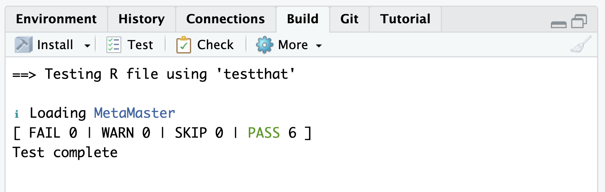

---


## Agenda {.center .agenda}


  1. Testing Intro
  2. Testthat Functions
  3. Types of Testing
  4. Getting dirty


---


## 01 Testing Intro {.center background-color="#E41A1C"}


---

## Testthat

*Write code → Define expectations → Run tests → Catch problems*

:::: {.columns}

::: {.column width="50%"}

[`testthat`](https://testthat.r-lib.org){target="_blank"} is the standard way for writing tests. Define what the code is expected to do, testthat automatically checks whether those expectations are met.

Instead of manually checking results every time code changes, we can write tests once and run them repeatedly.

:::

::: {.column width="40%"}
<br/>
{.nostretch fig-align="center" width="250px"}

:::

::::


---

## Testthat in a Nutshell

:::: {.columns}

::: {.column width="50%"}

*Arrange → Act → Assert*

```{r}
#| echo: true
#| eval: false
# Example Code
test_that("what am I testing?", {
  
  # Arrange
  input <- ...
  
  # Act
  result <- my_function(input)
  
  # Assert
  expect_equal(result, ...)
  
})
```

:::

::: {.column width="40%"}
<br/>

{.nostretch width="250px"}


:::

::::


 `r emoji::emoji("hand")` Testthat has several `expect_*` functions to test expectations.


---

## Testthat in your workflow


Testthat runs automatically in an `R CMD Check`, include it in your CI/CD pipeline, period!


{.nostretch width="650px"}


Plus: `usethis` helps with the setup and to add new tests:

```{r}
#| echo: true
#| eval: false
# Set up the test infrastructure and build a test

usethis::use_testthat()
usethis::use_test("R-file")
```


---

## `expect_equal`

Checks if two values are equal `r emoji::emoji("equal")`


::: {.panel-tabset}

### R

```{r}
#| error: true
library(testthat)
test_that("expect_equal checks equality", {
  result <- (function(x) x + x)(2)
  expect_equal(result, 4)
  expect_equal(
    c("apple", "banana"),
    c("apple", "kiwi")
  )
})
```

### Py


```{python}
#| echo: true
#| error: true
def test_expect_equal():
    assert 2 + 2 == 4
    assert ["apple", "banana"] == ["apple", "banana"]
    print("✓ All tests passed")

test_expect_equal()
```

:::


---

## Pytest

Write code → *Define assertions* → Run tests → Catch problems

:::: {.columns}

::: {.column width="50%"}

[`pytest`](https://docs.pytest.org/){target="_blank"} is the most popular way to write tests in Python. Define what the code is expected to do using simple *assert* statements, and pytest automatically checks whether those expectations are met.


:::

::: {.column width="40%"}

<br/>

{.nostretch fig-align="center" width="250px"}

:::

::::


--- 


## 02 Testthat Functions {.center background-color="#107895"}


---

## `expect_identical` 

Checks if objects are exactly identical `r emoji::emoji("twin")`

::: {.panel-tabset}

### R

```{r}
#| echo: true
test_that("expect_identical checks exact identity", {
  
  expect_identical(
    c(1, 2, 3),
    c(1, 2, 3)
  )
  
})
```

### Py


```{python}
#| echo: true
#| error: true
def test_expect_identical():
    assert [1, 2, 3] == [1, 2, 3]
    print("✓ All tests passed")

test_expect_identical()
```

:::


<br/>

*Similar to expect_equal(), but stricter.*


---

## `expect_true`

Checks if an expression evaluates to `TRUE`


::: {.panel-tabset}

### R

```{r}
#| echo: true
test_that("expect_true checks for TRUE", {
  
  x <- 10
  expect_true(x > 0)
  
})
```

### Py


```{python}
#| error: true
def test_expect_true():
    x = 10
    assert x > 0
    print("✓ All tests passed")

test_expect_true()
```

:::


---

## `expect_false`


Checks if an expression evaluates to `FALSE`


::: {.panel-tabset}

### R

```{r}
#| error: true
test_that("expect_false checks for FALSE", {
  
  x <- 10
  expect_false(x == 20)
  
})
```

### Py


```{python}
def test_expect_false():
    x = 10
    assert not (x == 20)
    print("✓ All tests passed")

test_expect_false()
```

:::


---

### `expect_null`

Checks that the result is `NULL`

::: {.panel-tabset}

### R

```{r}
#| error: true
test_that("expect_null checks for NULL", {
  
  result <- 0
  expect_null(result)
  
})
```

### Py


```{python}
#| error: true
def test_expect_null():
    result = 0
    assert result is None
    print("✓ All tests passed")

test_expect_null()
```

:::


---

### `expect_length`, `expect_type` & `expect_s3_class`

Checks the length, type, class of an object  `r emoji::emoji("horse")` 

::: {.panel-tabset}

### R

```{r}
#| error: true
test_that("expect_length checks length, ...", {
  
  legs <- c(1, 1, 1, 1)

  expect_length(legs, 4)
  expect_type(legs, "double")

  myvar <- factor(c("A", "B", "A"))
  expect_s3_class(myvar, "factor")
  
})

```

### Py


```{python}
#| error: true
def test_length_checks_length():
    legs = [1, 1, 1, 1]

    assert len(legs) == 4
    assert all(isinstance(x, float) for x in legs)

    myvar = ["A", "B", "A"]
    assert isinstance(myvar, list)
    print("✓ All tests passed")

test_length_checks_length()
```

:::


---

### `expect_error`

Checks if code produces an error `r emoji::emoji("x")`

::: {.panel-tabset}

### R

```{r}
#| error: true
divide <- function(x, y) {
  if (y == 0) {
    stop("Cannot divide by zero")
  }

  x / y
}

test_that("expect_error checks errors", {
  
  expect_error(
    divide(10, 0)
  )
})
```

### Py


```{python}
#| error: true
def divide(x, y):
    if y == 0:
        raise ValueError("Cannot divide by zero")
    return x / y

def test_expect_error():
    try:
        divide(10, 0)
    except ValueError:
        print("✓ expect_error: error detected")
    else:
        raise AssertionError("Expected ValueError, but no error was raised")

test_expect_error()
```

:::


---

### `expect_warning`

Checks that code produces a warning. `r emoji::emoji("warning")`

::: {.panel-tabset}

### R

```{r}
#| error: true
square_me <- function(x) {
  
  if (x < 0) {
    warning("Negative value")
  }
  
  x^2
}

test_that("expect_warning checks warnings", {
  
  expect_warning(
    square_me(-5)
  )
})
```

### Py


```{python}
#| error: true
import warnings

def square_me(x):
    if x < 0:
        warnings.warn("Negative value")
    return x ** 2

def test_expect_warning():
    with warnings.catch_warnings(record=True) as caught:
        warnings.simplefilter("always")
        square_me(-5)
    if caught:
        print("✓ Warning detected")
    else:
        print("✗ No warning detected")

test_expect_warning()
```

:::


---


## 03 Test Types {.center background-color="#e64173"}


--- 

## Unit tests

A unit test tests the smallest meaningful piece of code, usually a function, method, or class. They're the foundation of an automated test suite. Unit tests are usually:

  - Fast
  - Numerous
  - Automated
  - Isolated from databases, networks, external services, etc.


:::{.callout-note}

## Unit Testing
- Test main logic
- Test weird/boundary cases too
- And potentially invalid input

:::


--- 

## My First Unit Test

Suppose you work on a function to like this:

```{r}
#| echo: true
calculate_pass_rate <- function(passed, 
                                total_students) {

  result <- passed / total_students
  result
}
```


Add a simple unit test:

```{r}
#| error: true
# Unit testing #######
test_that("pass rate is calculated correctly", {
  expect_equal(
    calculate_pass_rate(80, 100), 0.8
  )
})

```


--- 


## What if ...

R returns silently `NaN` and not an error if user `0` as input

```{r}
#| echo: true
#| error: true
calculate_pass_rate(0, 0)
```

The `expect_error` function would have informed us about this bug:

```{r}
#| echo: true
#| error: true
test_that("pass rate handles no students", {
  expect_error(
    calculate_pass_rate(0, 0)
  )
})

```


--- 

## Update the Example Function


```{r}
#| echo: true
calculate_pass_rate <- function(passed, total_students) {
  if (total_students <= 0) {
    stop("total_students must be greater than zero")
  }

  result <- passed / total_students
  result
}
```


And test again: 

```{r}
#| echo: true
test_that("pass rate handles no students", {

  expect_error(
    calculate_pass_rate(0, 0)
  )

})
```


---

## Smoke Test
Is this build stable enough for us to bother testing it further? Can we build it?

### Example Run Pipeline

```{r}
#| echo: true
#| error: false
run_pipeline <- function(variables) {
  result <- tibble::tibble(success = TRUE, predictions = NA)
  result
}

```

Test it ...

```{r}
#| echo: true
#Smoke Test
test_that("pipeline can run successfully", {
  
  result <- run_pipeline()
  expect_true(result$success)
})

```


---

## Regression testing

Did something that used to work stop working because of a change?

Regression testing attempts to catch these unintended consequences due to code development.


```{r}
#| error: true
test_that("pipeline does not introduce missing predictions", {
  
  result <- run_pipeline(test_data)
  
  expect_false(
    any(is.na(result$predictions))
  )
})


```


---

## Snap shots


:::: {.columns}

::: {.column width="50%"}
```{r}
#| echo: true
library(ggplot2)


make_plot <- function() {
  ggplot(mtcars, aes(x = wt, 
                    y = mpg)) +
    geom_point()
}

```
:::

::: {.column width="50%"}

```{r}
#| echo: false
make_plot()
```

:::

::::


### Snapshotting a `ggplot`

The `vdiffr` packages saves a reference plot when the test runs for the first time and compares the result of plot function with the reference

```{r}
#| eval: false
#| echo: true
test_that("car plot looks correct", {
  vdiffr::expect_doppelganger(
    "car scatter plot",
    make_plot()
  )
})
```


---

## Snap shots


Testthat throws an error and ask you to assess changes via `snapshot_review()`. This opens the viewer and shows the changes:

{.nostretch fig-align="center" width="600px"}


 `r emoji::emoji("hand")` Reject or Accept


---


## 04 Ado {.center background-color="#107895"}


---

## Test coverage (htmlcov/covr)

"Track test coverage for your R package and view reports locally or (optionally) upload the results to codecov or coveralls. (Hester 2023)"

<iframe
  src="htmlcov/index.html"
  style="width: 100%; height: 80vh; border: none;">
</iframe>


---

## The End

{.nostretch fig-align="center" width="600px"}


